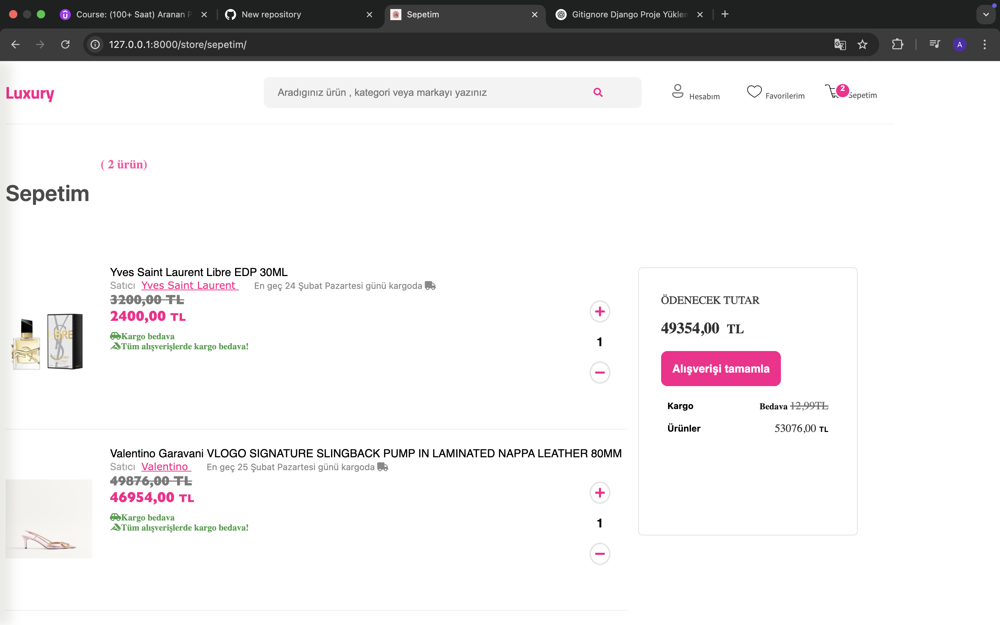
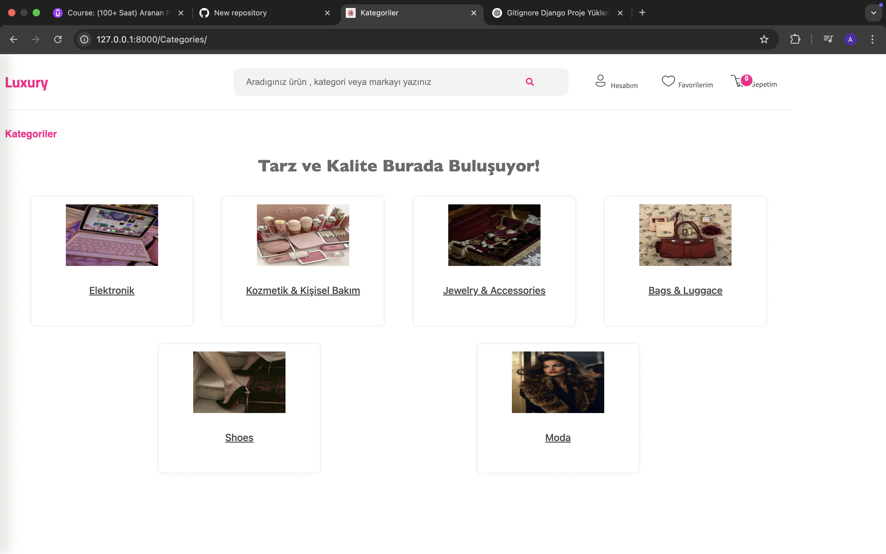
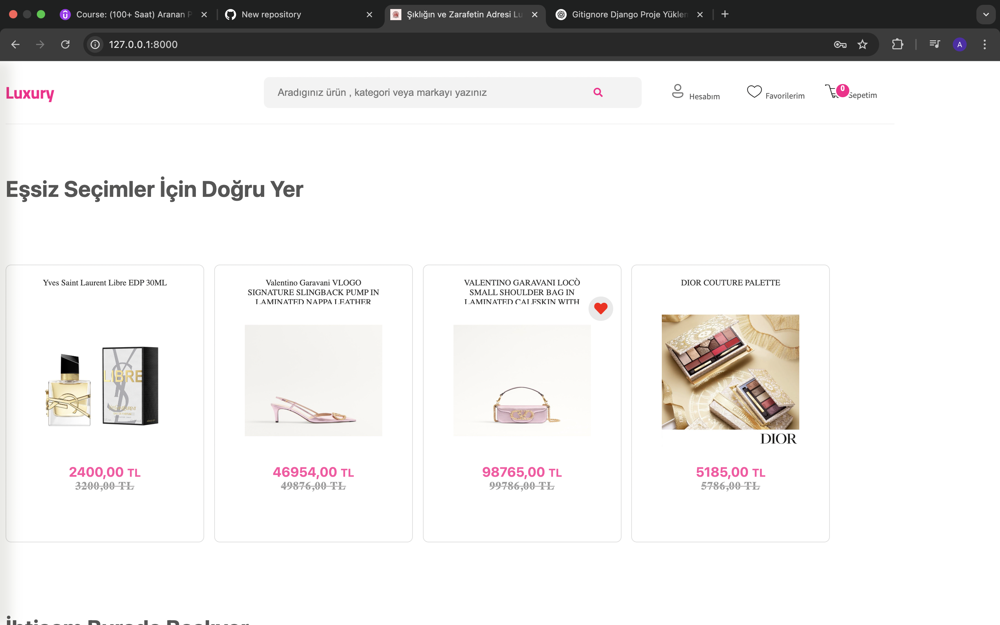
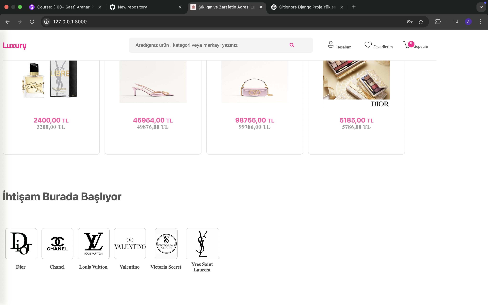
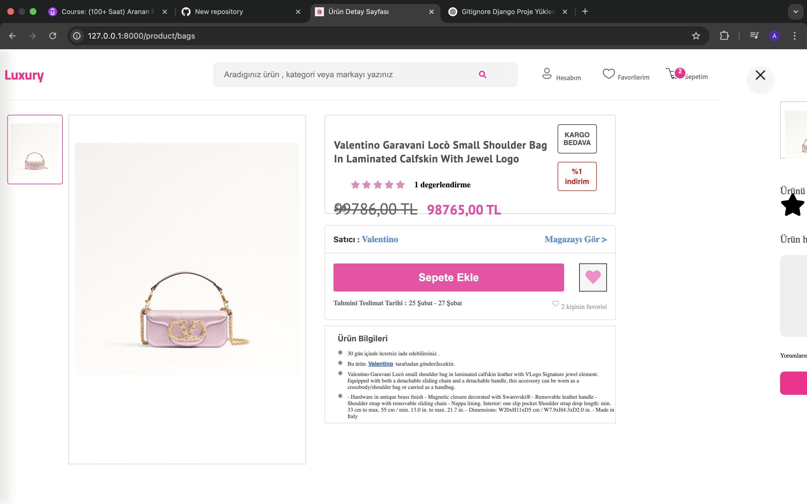
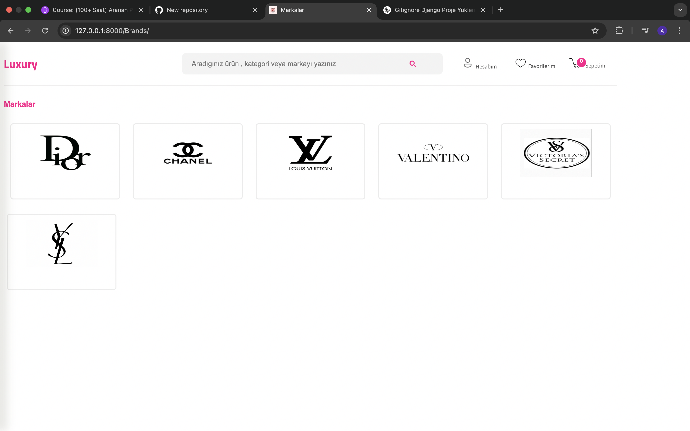

<h1 align="center">Luxury</h1>

<h5 align="center"> Luxury is an open-source ecommerce website built on the Django Web Framework.</h5>
<!--  ## Kurulum  <br/> -->
 
## Installation

#### 1. Install Packages

```
pip install -r requirements.txt
```

#### 2.Setup Virtualenv

```
virtualenv venv
```

```
Linux & Mac: source venv/bin/activate

Windows: venv\Scripts\activate
```

#### 3.Migrate & Start Server

```
python manage.py makemigrations
python manage.py migrate
python manage.py createsuper
python manage.py runserver
```

<!--
İndirdikten sonra proje dizini içerisinde :

 ` virtualenv venv`

 Linux & Mac: `source venv/bin/activate `

Windows: `venv\Scripts\activate `

`pip install -r requirements.txt `

`python manage.py makemigrations`

`python manage.py migrate`

`python manage.py createsuperuser`

`python manage.py runserver`
  -->
 <br/>


<br/>
<p align="center">
****
</p>

<br/>

<p align="center">
****
</p>

<br/>

<p align="center">
****
</p>

<br/>

<p align="center">
****
</p>

<br/>

<p align="center">
****
</p>

<br/>

<p align="center">
****
</p>
